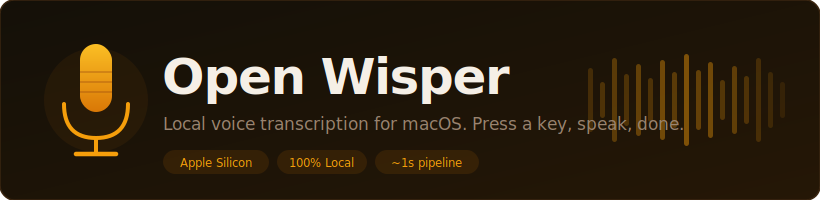

<div align="center">
  

  <br/>
  <br/>

  <a href="https://github.com/AbubakrChan/open-wisper/blob/main/LICENSE">
    
  </a>
  
  
  
  

  <br/>
  <br/>

  <p>
    Built because Wispr Flow was too slow — sometimes 5–10 seconds per transcription, occasionally failing silently.<br/>
    Apple Silicon can run a state-of-the-art speech model in under a second, entirely on your device.<br/>
    Open Wisper does exactly that.
  </p>

  <strong>No subscription. No cloud. No clipboard pollution. Just your voice, pasted.</strong>

</div>

---

## What it does

Press **Fn+R** → speak → press **Fn+R** again.

Your words appear in whatever app you were using, as if you typed them. The full pipeline — recording, transcription, paste — completes in ~1 second. Everything runs locally on your Mac. Nothing is sent anywhere.

---

## Features

| | |
|---|---|
| **Global hotkey** | Fn+R toggles recording from any app — customizable in Settings |
| **Auto-paste** | Text is pasted directly into your active window. No Cmd+V needed |
| **Clipboard-safe** | Your clipboard is preserved. Old content is restored within 300ms |
| **100% local** | Audio never leaves your Mac. No account, no API key, no internet after setup |
| **Custom hotkey** | Change the trigger key from Settings — no code editing needed |
| **Model selection** | 4 models: trade off speed, RAM, and accuracy |
| **Microphone selection** | Built-in mic, AirPods, USB interface — switch any time |
| **Transcription history** | Every recording saved to a local SQLite database |
| **Filter by app** | Transcriptions grouped by which app was active when you recorded |
| **Export** | Save full history as `.md` or `.txt` in one click |
| **Launch at login** | Start automatically with macOS — toggle in Settings |
| **Apple Silicon optimized** | Uses MLX, Apple's own ML framework for on-device inference |
| **Model stays in RAM** | Loaded once at startup, kept warm. No cold-start delay per recording |
| **Menu bar app** | Lives in your menu bar. No dock icon, no window clutter |
| **Sound feedback** | Audio cues for start, stop, and transcription complete |
| **Open source** | ~1600 lines of Python. Read it, fork it, change anything |

---

## Fully local. Fully private.

Everything runs on your Mac. Nothing leaves your device.

- **No account** — there is no sign-up, no login, no profile
- **No API key** — the AI model runs directly on your Apple Silicon chip via MLX
- **No internet after setup** — the model is downloaded once (~750 MB), then works offline forever
- **No audio storage** — recordings are processed and immediately discarded; only the final text is saved
- **No telemetry** — no analytics, no crash reporting, no phone-home of any kind
- **Verifiable** — every line of code is in `app.py`. Read it and confirm it yourself

The only network request the app ever makes is the one-time model download from HuggingFace.

---

## Requirements

- macOS 12 or later
- Apple Silicon (M1 / M2 / M3 / M4)
- Python 3.9+ and Homebrew (the installer handles both)

---

## Getting started

**One command installs everything and launches the app:**

```bash
curl -fsSL https://raw.githubusercontent.com/AbubakrChan/open-wisper/main/install.sh | bash
```

The script installs all dependencies and opens Open Wisper automatically. A **setup wizard** then walks you through two steps:

1. **Download the AI model** — ~750 MB, one time only. Cached forever after.
2. **Grant permissions** — Microphone (one click) and Accessibility (for auto-paste).

The 🎤 icon appears in your menu bar. You're done.

**To re-launch Open Wisper in the future:**

```bash
python3 ~/Applications/OpenWisper/app.py
```

> **Accessibility permission** — macOS requires this to be granted manually in System Settings → Privacy & Security → Accessibility. The wizard opens the right page for you. Without it, the app still works — text is copied to your clipboard and you press Cmd+V.

---

## Using the app

| Action | How |
|--------|-----|
| Start recording | Press **Fn+R** (or your custom hotkey) |
| Stop and transcribe | Press **Fn+R** again |
| View history / settings | Click 🎤 in the menu bar → **History** |
| Change microphone | History → Settings → Microphone |
| Change model | History → Settings → Model |
| Change language | History → Settings → Language |
| Change hotkey | History → Settings → Hotkey → **Record** → press new combo |
| Launch at login | History → Settings → At Login |
| Export history | History → Export .md or Export .txt |

Menu bar icon states: 🎤 ready · 🔴 recording · ⏳ loading / transcribing

---

## Models

| Model | RAM | Speed | Languages |
|-------|-----|-------|-----------|
| **Distil Large V3** ← default | ~1.4 GB | fastest | English only |
| **Turbo Q8** | ~880 MB | fast | English + multilingual |
| **Large V3 Turbo** | ~1.6 GB | fast | All languages |
| **Tiny** | ~100 MB | ultra fast | All (lower accuracy) |

**Distil Large V3** is the default and recommended for most people. It skips language detection entirely — that single optimization saves ~0.4s on every recording and is why the pipeline hits ~1s. If you primarily speak English, use this.

**Turbo Q8** saves ~560 MB of RAM at a ~15% speed cost. Useful if you have 8 GB RAM and run memory-heavy apps alongside this one.

**Large V3 Turbo** runs language detection, then transcribes in whatever language you spoke. Use this if you switch between languages or speak a non-English language.

**Tiny** is for extremely RAM-constrained situations. Expect noticeably more errors on proper nouns and technical terms.

Change models any time in the Settings panel — no restart needed.

---

## How we made it fast

Whisper is accurate but not inherently fast. Getting to ~1s on an everyday Mac took several deliberate choices:

**Skip language detection** — Whisper normally runs a detection pass before transcribing, adding 0.3–0.5s. Setting `language="en"` skips it entirely. This is the biggest single win.

**Model stays in memory** — most tools load the model fresh on every transcription (3–5s overhead). Open Wisper loads the model once at startup in a persistent subprocess and keeps it there.

**Warmup run** — immediately after loading, a 0.5s silent clip runs through the model to page weights into GPU memory. Your first real recording is as fast as every other.

**Keepalive every 3 minutes** — macOS can evict GPU memory from idle processes. A silent ping every 3 minutes keeps model weights resident, so you get fast transcription even after a long break.

**Metal cache cap at 200 MB** — MLX's GPU memory cache is capped at 200 MB instead of the default 400 MB+. Less memory pressure on 8 GB Macs.

**16 kHz mono audio** — Whisper was trained on 16 kHz mono. We record at exactly this format, skipping any resampling step before inference.

**Distillation** — Distil-Whisper Large v3 is 6× smaller than full Whisper Large v3 but retains ~98% of English accuracy. It's the default for a reason.

---

## Customization

Most settings are in the **History panel** — no code editing needed:

| Setting | Where |
|---------|-------|
| Hotkey | History → Settings → Hotkey → Record |
| Model | History → Settings → Model |
| Language | History → Settings → Language |
| Microphone | History → Settings → Microphone |

**Add any Whisper model from HuggingFace**

Find the `MODELS` list near the top of `app.py` and add a line:

```python
MODELS = [
    ("mlx-community/distil-whisper-large-v3", "Distil Large V3 — fastest, English"),
    ("your-org/your-model",                   "My custom model"),  # ← add here
    ...
]
```

Any `mlx-community` Whisper model on HuggingFace works. It appears in the Settings panel immediately and downloads on demand.

**Change the default hotkey (for first-launch)**

The default hotkey is `DEFAULT_HOTKEY_KEYCODE` and `DEFAULT_HOTKEY_FLAGS` at the top of `app.py`. Users can always change it without code via Settings → Hotkey.

---

## Data

All data lives in `~/.open-wisper/`:

| File | Contents |
|------|----------|
| `history.db` | SQLite database of all transcriptions and settings |
| `app.log` | Application logs |

Model weights are cached in `~/.cache/huggingface/` by HuggingFace Hub.

To fully reset: `rm -rf ~/.open-wisper/`

---

## Troubleshooting

**Icon shows ⏳ and stays there**
→ Model is loading — wait 5–15 seconds on first launch. If it stays longer, check `~/.open-wisper/app.log`.

**Hotkey does nothing**
→ Accessibility permission is missing. System Settings → Privacy & Security → Accessibility → add and enable Python (or OpenWisper.app).

**Text not auto-pasting**
→ Same. Without Accessibility, text is still copied to your clipboard — press Cmd+V manually.

**App keeps asking for Accessibility permission**
→ Happens when you run `make rebuild` — each new bundle gets a new identity. Fix: use `python3 app.py` for day-to-day use. Grant permission once for Python and it never resets. Only rebuild the bundle when distributing.

**Recording sounds wrong or cuts out**
→ Try a different microphone in History → Settings → Microphone.

**Transcription is inaccurate**
→ Switch to a larger model. If you're on Tiny, try Distil Large V3.

**Model download fails**
→ Check your connection and relaunch. Check `~/.open-wisper/app.log` for details.

**Wizard doesn't appear on relaunch**
→ It only shows on first launch. To reset: `rm -rf ~/.open-wisper/ && python3 app.py`

---

## Building a standalone .app (optional)

```bash
make install-bundle   # installs py2app — one-time
make rebuild          # builds dist/OpenWisper.app
open dist/OpenWisper.app
```

After each rebuild, re-grant Accessibility permission — the bundle identity changes with every build. For daily use, `python3 app.py` is simpler.

---

## Project structure

```
app.py           — the entire application (~1600 lines of Python)
install.sh       — one-command setup script for new users
setup.py         — py2app config for building the .app bundle
Makefile         — shortcuts: make dev, make build, make rebuild
requirements.txt — Python dependencies
assets/          — banner and other static assets
LICENSE
```

---

## License

MIT — do whatever you want with it.
